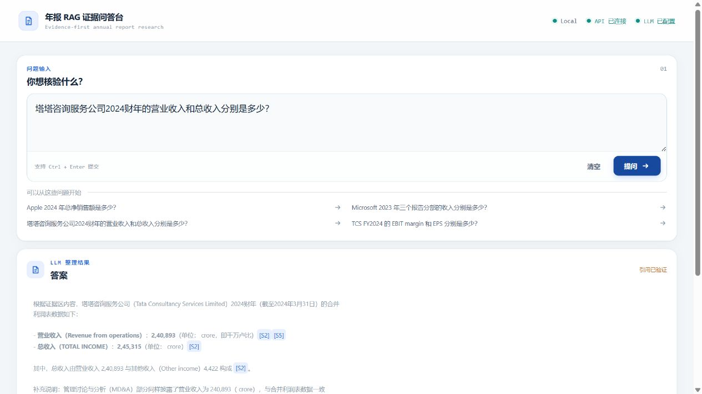

# 年报问答 RAG V1.3

这是一个面向年报财务问答的单公司 RAG 项目。系统按公司过滤检索范围，一次查询只处理一家公司的材料，不进行跨公司比较。当前数据库中的 12 个来源来自 Apple、Microsoft 和 Tata Consultancy Services（TCS）；公司数量由现有入库材料决定，不是代码中固定的公司白名单。

当前版本为 `v1.3.0`，增加连续年报、复合问题混合检索与单次回答流程。更新内容见 [V1.3 更新说明](docs/V1.3更新说明.md)。

## 当前数据

仓库只保留一个活动 Qdrant 集合：`annual_report_v1_single_company`，共 6266 个向量点。数据库没有第二套 V2 集合。

| 入库来源 | 格式 | 向量点 | 可查询年度说明 |
| --- | --- | ---: | --- |
| Apple 2024 Form 10-K | PDF | 581 | 报表包含 2024、2023、2022 对比列 |
| Apple 2022 Form 10-K | PDF | 461 | 报表包含 2022、2021、2020 对比列 |
| Apple 2023 Form 10-K | PDF | 453 | 报表包含 2023、2022、2021 对比列 |
| Microsoft 2023 Annual Report | PDF | 205 | 期间报表包含 2023、2022、2021；资产负债表包含 2023、2022 |
| Microsoft 2021 Annual Report | PDF | 210 | 期间报表为 2021 财年 |
| Microsoft 2022 Annual Report | PDF | 213 | 期间报表为 2022 财年 |
| TCS 2021 Annual Report | PDF | 970 | 主要财务表包含 FY2021、FY2020 |
| TCS 2022 Annual Report | PDF | 1022 | 主要财务表包含 FY2022、FY2021 |
| TCS 2023 Annual Report | PDF | 1009 | 主要财务表包含 FY2023、FY2022 |
| TCS 2024 Annual Report | PDF | 1024 | 主要财务表包含 FY2024、FY2023 |
| TCS FY2022-2024 Equity Research Report | DOCX | 3 | TCS 研究材料 |
| TCS FY2022-2024 Financial Analysis | XLSX | 115 | TCS 财务分析表 |

Apple 2022、2023、2024 与 Microsoft 2021、2022、2023 均已登记独立年报原件；各年报自身仍包含相邻年度对比列。

原始文件统一位于 `data/annual_reports/raw/`。来源 URL、仓库内路径和 SHA-256 见 [data/SOURCES.md](data/SOURCES.md)。

## 处理链路

```text
PDF / DOCX / XLSX
        |
解析 -> 清洗 -> 结构化切块
        |
DeepSeek Planner -> 原问与分任务查询
        |
BGE-M3 Dense + BM25 并行召回 -> RRF 融合
        |
公司/文档过滤 -> 去重与条件重排 -> Evidence 组装
        |
单次回答生成 -> 引用校验 -> 前端答案与来源定位
```

当前实现包括 PDF、DOCX、XLSX 解析与清洗，结构化切块，BGE-M3 向量化，Qdrant Local，BM25/Dense/Hybrid 检索，DeepSeek 查询规划、条件语义重排和回答生成，以及中文公司别名、公司隔离和表格上下文处理。数值检查作为诊断记录，来源引用通过校验后保留模型回答原文。

## 真实界面

主问答界面：



检索线索、证据原文和来源定位：


## 当前验收边界

- V1.3 离线回归：全量 `115/115` 通过，其中检索、API、计算诊断和复合问题核心模块 `98/98`。
- V1.3 实际 API 检索：固定 12 题各运行两次，`24/24` 命中前 5 条，`MRR@10=0.833`；属于小样本检索验收，不代表生成正确率。
- 微软三年复合题实测完整返回 18 项分部原始数值及分析章节；仍观察到 CAGR 小数计算偏差，计算与推理需要核对来源。
- Chunks / Qdrant points：`6266 / 6266`；本轮新增 Apple 2022/2023、Microsoft 2021/2022 共 `1337 / 1337`，TCS 2021 已有 `970 / 970`。
- V1.2 固定题集：Apple、Microsoft、TCS 各 7 题，共 21 题；冻结结果四层指标均为 `21/21`。
- 中文别名题集：三家公司各 2 题，共 6 题；完整链路冻结结果五层指标均为 `6/6`。
- 中文问题绕过 Planner 时，retrieval coverage 为 `2/6`。原因是部分中文财务术语没有完整转换为英文年报字段，完整链路依靠 Planner 补全中英文检索表达。

历史题集结果见 [V1 问题案例与测试结果边界](docs/V1问题案例与测试结果边界.md)；当前版本的测试范围和复合题入口见 [V1.3 更新说明](docs/V1.3更新说明.md)。

## 配置文件

GitHub 中提供的配置模板是项目根目录的 [.env.example](.env.example)。

在项目根目录执行：

```powershell
Copy-Item .env.example .env
```

然后在 `.env` 中填写 `DEEPSEEK_API_KEY`，或分别填写 `DEEPSEEK_PLANNER_API_KEY` 与 `DEEPSEEK_ANSWER_API_KEY`。所有配置字段、默认值和 `.env` 加载位置定义在 [rag_api/settings.py](rag_api/settings.py)。

| 配置项 | 默认位置或值 |
| --- | --- |
| `QDRANT_COLLECTION` | `annual_report_v1_single_company` |
| `QDRANT_PATH` | `./xianlian` |
| `CHUNK_DIR` | `./data/processed/annual_reports/v1_single_company_chunks` |
| `EMBEDDING_MODEL_PATH` | `./models/bge-m3-embedding/model_quantized.onnx` |
| `EMBEDDING_TOKENIZER_PATH` | `./models/bge-m3` |

Planner 和 Answer 默认使用 `deepseek-v4-flash`，thinking disabled。

## 本地准备

```powershell
py -3.13 -m venv .venv_rag
.\.venv_rag\Scripts\python.exe -m pip install -r requirements-rag.txt
Copy-Item .env.example .env
```

## BGE-M3 权重

ONNX 权重单文件超过 GitHub 普通 Git 的 100 MiB 限制，不包含在仓库中。运行前将权重放到：

```text
models/bge-m3-embedding/model_quantized.onnx
```

已验证 SHA-256：

```text
0826f8c1ab9edf1801db86c61919d4d108e8bfc0b809ec823ad366882ff0b77d
```

Tokenizer 已包含在 `models/bge-m3/`，详细说明见 [models/README.md](models/README.md)。

## 启动

终端一：

```powershell
.\.venv_rag\Scripts\python.exe -m uvicorn rag_api.app:app --host 127.0.0.1 --port 8001
```

终端二：

```powershell
$env:RAG_API_ORIGIN='http://127.0.0.1:8001'
node frontend/server.mjs
```

浏览器访问 `http://127.0.0.1:3000/`。

## 目录

```text
.github/       无需 DeepSeek Key 的离线 CI
chunking/      切块与完整性检查
cleaners/      PDF、DOCX、XLSX 清洗
embeddings/    BGE-M3、BM25、Dense、Hybrid/RRF
parsers/       PDF、DOCX、XLSX 解析
prompts/       查询规划与回答提示词
rag_api/       FastAPI、DeepSeek、引用校验
frontend/      问答界面和 Node 代理
scripts/       当前集合构建、检查和 V1 评测
data/          12 个活动来源、当前切块、题集和冻结结果
xianlian/      唯一的 Qdrant Local 活动数据库
docs/          最终问题边界、问题集和真实前端测试证据
```
