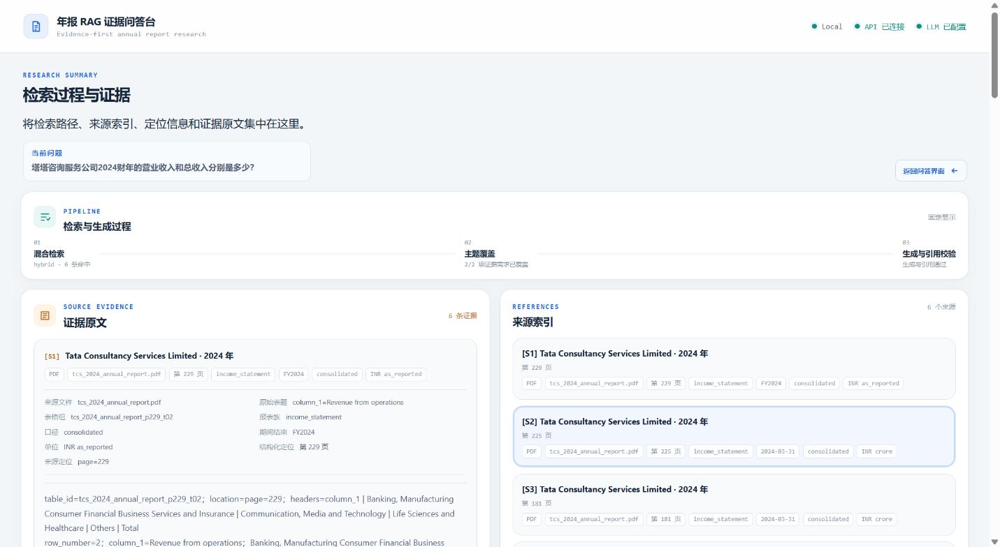

# 年报问答 RAG V1

这是一个面向年报财务问答的单公司 RAG 项目。当前活动数据库仅收录 Apple、Microsoft、Tata Consultancy Services 的材料，因此现有查询数据范围是这三家公司；该范围来自已入库材料，不代表系统能力被固定为三家公司。一次查询只限定一家公司，不进行跨公司比较。

## V1 范围

当前活动集合 `annual_report_v1_single_company` 有 7 个来源、3959 个向量点：

| 来源 | 格式 | 活动点数 | 内容范围 |
| --- | --- | ---: | --- |
| Apple 2024 Form 10-K | PDF | 581 | 年报表格同时包含 2024、2023、2022 对比列 |
| Microsoft 2023 Annual Report | PDF | 205 | 利润表、综合收益表、现金流量表等包含 2023、2022、2021；资产负债表包含 2023、2022 |
| TCS 2022 Annual Report | PDF | 1022 | 主要财务表包含 FY2022、FY2021 对比数据 |
| TCS 2023 Annual Report | PDF | 1009 | 主要财务表包含 FY2023、FY2022 对比数据 |
| TCS 2024 Annual Report | PDF | 1024 | 主要财务表包含 FY2024、FY2023 对比数据 |
| TCS FY2022-2024 Equity Research Report | DOCX | 3 | TCS 2022-2024 研究材料 |
| TCS FY2022-2024 Financial Analysis | XLSX | 115 | TCS 2022-2024 财务分析表 |

此前能够回答部分 Apple 2023 数据，是因为 Apple 2024 Form 10-K 的对比表中包含 2023 列，不代表活动数据库中存在独立的 Apple 2023 文档。Microsoft 同理：活动数据库中只有 Microsoft 2023 Annual Report 这一份 Microsoft 来源，但该报告包含 2023、2022、2021 多年度对比数据，并不只有 2023 年数据。

- PDF、DOCX、XLSX 解析与清洗。
- 结构化切块、BGE-M3 向量化、Qdrant Local。
- BM25、Dense、Hybrid/RRF 检索。
- DeepSeek Flash 查询规划、回答生成和引用复核。
- 中文公司别名、公司隔离、完整表格上下文和固定题集评测。

## 材料来源

当前活动数据库使用 5 份公司年报 PDF、1 份 DOCX 研究报告和 1 份 XLSX 财务分析表。仓库还补充保留 Apple 2022、Apple 2023 两份原始 PDF，用于对应已保留的 PDF 切块材料；这两份补充 PDF 未进入当前活动 Qdrant 集合。材料来源 URL 与文件校验值见 [data/SOURCES.md](data/SOURCES.md)，BGE-M3 Tokenizer 与本地模型信息见 [models/README.md](models/README.md)。

## 当前验收

- 活动集合：`annual_report_v1_single_company`。
- Chunks / Qdrant points：`3959 / 3959`。
- V1.2 固定题集：2026-08-14 冻结报告中，Apple、Microsoft、TCS 各 7 题，共 21 题；四层指标均 `21/21`。
- 中文别名题集：2026-08-14 完整链路冻结报告中，三家公司各 2 题，共 6 题；五层指标均 `6/6`。
- 中文问题纯召回结果：绕过 Planner 时 retrieval coverage 为 `2/6`；主要原因是部分中文财务术语与英文年报字段没有完成转换，完整链路通过 Planner 补全中英文检索表达。

固定题集通过只表示当前数据和边界内的回归结果，不代表开放问题或任意年报具有 100% 准确率。

完整的问题案例、历史失败、纯召回限制和各测试数字的解释见 [V1 问题案例与测试结果边界](docs/V1问题案例与测试结果边界.md)。

## 处理链路

```text
PDF / DOCX / XLSX
        |
解析 -> 清洗 -> 结构化切块
        |
 BGE-M3 Dense + BM25
        |
Qdrant + Hybrid/RRF + 单公司过滤
        |
DeepSeek Planner -> 分任务召回 -> Evidence 组装
        |
回答生成 -> 引用复核 -> 前端答案与来源定位
```

## 真实界面



## 目录

```text
.github/       无需 DeepSeek Key 的离线 CI
chunking/      切块与切块完整性检查
cleaners/      PDF、DOCX、XLSX 清洗
embeddings/    BGE-M3 编码、BM25、Dense、Hybrid/RRF
parsers/       PDF、DOCX、XLSX 解析
prompts/       查询规划与回答提示词
rag_api/       FastAPI、DeepSeek、引用校验
frontend/      原生 HTML/CSS/JavaScript 前端和 Node 代理
scripts/       构建、审计和评测脚本
data/          7 份活动来源、2 份补充原件、活动切块、固定题集和验收报告
xianlian/      已验收的 Qdrant Local 活动数据库
docs/          V1 边界、修改和真实测试记录
LICENSE        本项目代码和自有文档的 MIT 许可
THIRD_PARTY_NOTICES.md  第三方数据、模型与派生内容边界
```

## 本地准备

在项目根目录执行：

```powershell
py -3.13 -m venv .venv_rag
.\.venv_rag\Scripts\python.exe -m pip install -r requirements-rag.txt
Copy-Item .env.example .env
```

在 `.env` 中填写：

```text
DEEPSEEK_PLANNER_API_KEY=...
DEEPSEEK_ANSWER_API_KEY=...
```

Planner 和 Answer 均固定使用 `deepseek-v4-flash`，thinking disabled。

## BGE-M3 权重

GitHub 不允许普通 Git 提交超过 100 MiB 的单文件，因此 `569,694,530` 字节的 ONNX 权重不包含在仓库中。运行前需要把已验证的权重放到：

```text
models/bge-m3-embedding/model_quantized.onnx
```

已验证 SHA-256：

```text
0826f8c1ab9edf1801db86c61919d4d108e8bfc0b809ec823ad366882ff0b77d
```

Tokenizer 已包含在 `models/bge-m3/`。更多信息见 [models/README.md](models/README.md)。

## 启动

终端一，启动 FastAPI：

```powershell
.\.venv_rag\Scripts\python.exe -m uvicorn rag_api.app:app --host 127.0.0.1 --port 8001
```

终端二，启动前端：

```powershell
$env:RAG_API_ORIGIN='http://127.0.0.1:8001'
node frontend/server.mjs
```

浏览器访问 `http://127.0.0.1:3000/`。
